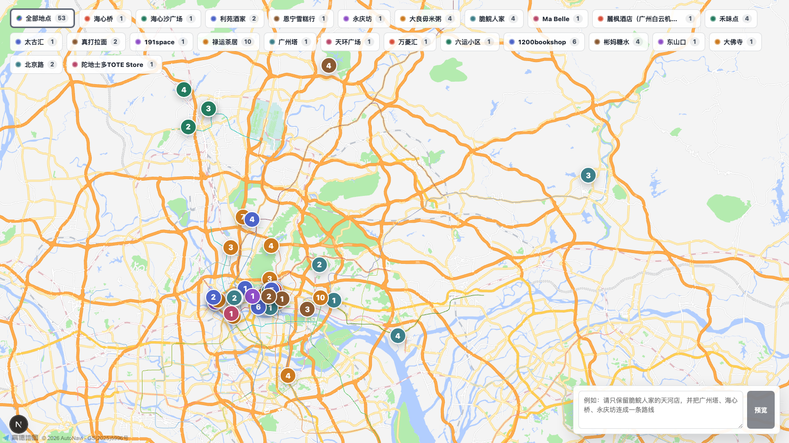
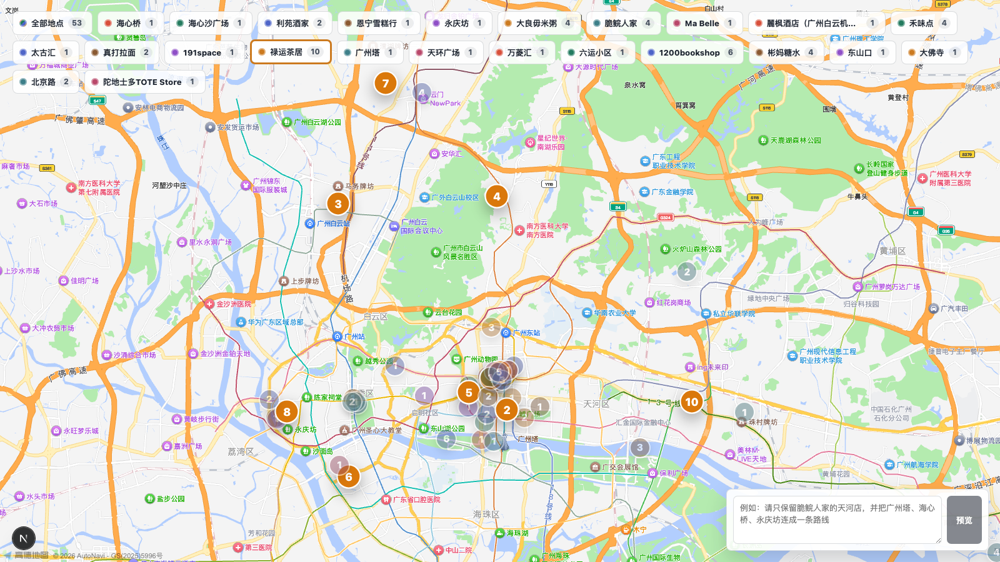

# MyMap

MyMap is an AI-assisted map workspace for collecting, filtering, editing, and exporting travel map data.

The current MVP can import a compact seed list, fetch POI candidates from AMap, use an LLM to select relevant results, render an interactive map, and export a PNG. The product direction is broader: imported places become workspace data that can later be organized with Categories, Tags, Places, Branches, Routes, and Archive.

```text
import seed
  -> POI search
  -> LLM selection
  -> map workspace data
  -> interactive map
  -> PNG export
```

For the canonical future data model, see:

```text
docs/2026-05-11-final-workspace-design.md
```

## Preview

All generated places:



Selected place:



## Current MVP Input

Create or edit `data/seeds.json`:

```json
{
  "city": "广州",
  "items": [
    "海心桥",
    "永庆坊",
    "利苑酒家",
    "太古汇"
  ]
}
```

In the current implementation, `city` is used as the AMap POI search boundary and `items` are place names to import. In the future workspace model, seed files become import recipes under `data/imports/seeds/` and should incrementally add data instead of resetting the map.

## API Keys

MyMap requires AMap for POI data and map rendering, plus one LLM provider for candidate selection.

### AMap

Create keys in the AMap developer console:

```text
AMAP_WEB_SERVICE_KEY=...
AMAP_JS_API_KEY=...
AMAP_JS_API_SECURITY_JS_CODE=...
```

Use `AMAP_WEB_SERVICE_KEY` for Web Service POI search. Use `AMAP_JS_API_KEY` and `AMAP_JS_API_SECURITY_JS_CODE` for the browser map.

### LLM

DeepSeek is the default provider:

```text
LLM_PROVIDER=deepseek
DEEPSEEK_API_KEY=...
```

OpenAI is also supported:

```text
LLM_PROVIDER=openai
OPENAI_API_KEY=...
```

## Quick Start

```bash
npm start
```

The setup script writes `.env`, installs dependencies, prepares `data/seeds.json` if needed, runs POI search, runs LLM selection, generates map data, and starts the local app.

Open:

```text
http://127.0.0.1:5173/
```

## Update Imported Places

Edit:

```text
data/seeds.json
```

Then regenerate and run:

```bash
npm run generate
npm run dev
```

## Screenshot

```bash
npm run screenshot
```

Default output:

```text
output/mymap.png
```

Custom output:

```bash
npm run screenshot -- --width 2560 --height 1440 --output output/my-trip-map.png
```

## Scripts

```bash
npm start              # interactive setup and run
npm run fetch:places   # fetch POI candidates
npm run merge:points   # run LLM selection and merge map data
npm run generate       # fetch:places + merge:points
npm run dev            # start the local map app
npm run screenshot     # export PNG
npm run check          # typecheck, test, and build
```

## Generated Data

Current generated files:

```text
data/places/*.json
data/selections/*.selection.json
data/map-state.json
data/routes.json
output/*.png
```

These runtime outputs are ignored by Git and can be recreated from imports and API calls.

## Design Notes

Important design documents are tracked in `docs/`.

The current source of truth for future architecture is:

```text
docs/2026-05-11-final-workspace-design.md
```

