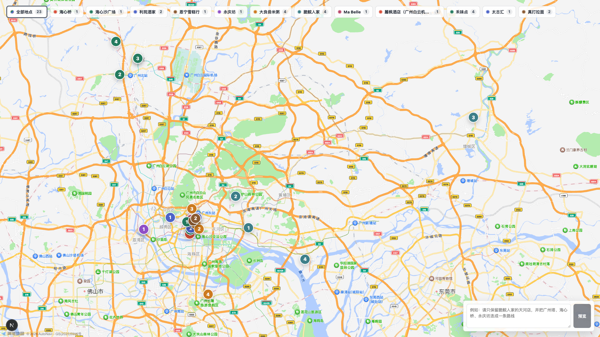

# MyMap

MyMap turns a tiny list of place names into an AI-assisted travel map.

You write a seed file like this:

```json
{
  "city": "广州",
  "items": ["海心桥", "永庆坊", "利苑酒家", "太古汇"]
}
```

Then MyMap:

1. searches POI candidates with AMap Web Service,
2. asks an LLM to filter noisy candidates,
3. writes clean JSON map state,
4. renders the points and routes with AMap JS API,
5. lets you preview AI edits before applying them,
6. exports a PNG screenshot for Excalidraw or other layout tools.

```text
data/seeds.json
  -> data/places/*.json
  -> data/selections/*.selection.json
  -> data/map-state.json
  -> Next.js map UI
  -> output/mymap.png
```

## Preview



## What Works Today

- City comes from `data/seeds.json`; it is not hard-coded to Guangzhou.
- AMap POI search uses `region=<seed.city>` with `city_limit=true`.
- Each fetched place group stores its `city`, candidate branches, addresses, districts, and GCJ-02 coordinates.
- LLM selection runs per place group and caches results under `data/selections/`.
- DeepSeek V4 Flash is the default LLM provider.
- OpenAI Chat Completions is supported by setting `LLM_PROVIDER=openai`.
- The browser map supports group filters, route filters, AI preview, apply, and revert.
- Route-only previews and point-only previews are both supported.
- Screenshots are generated with Playwright.

## Quick Start

```bash
npm start
```

The interactive script will:

1. ask for API keys,
2. write `.env`,
3. install dependencies,
4. create `data/seeds.json` from `data/seeds.example.json` if needed,
5. fetch POI candidates,
6. run LLM candidate selection,
7. start the local map at [http://127.0.0.1:5173/](http://127.0.0.1:5173/).

After the sample works, edit `data/seeds.json` and rerun `npm start`.

## Manual Workflow

Install dependencies:

```bash
npm install
```

Fetch POI candidates:

```bash
npm run fetch:places
```

Merge selected map points:

```bash
npm run merge:points
```

Start the map UI:

```bash
npm run dev
```

Open:

```text
http://127.0.0.1:5173/
```

Export a screenshot:

```bash
npm run screenshot
```

Custom screenshot:

```bash
npm run screenshot -- --width 2560 --height 1440 --output output/my-trip-map.png
```

## Environment

Copy the example file:

```bash
cp .env.example .env
```

Required for AMap:

```bash
AMAP_WEB_SERVICE_KEY=your_amap_web_service_key
AMAP_JS_API_KEY=your_amap_js_api_key
AMAP_JS_API_SECURITY_JS_CODE=your_amap_js_api_security_js_code
AMAP_JS_API_VERSION=2.0
```

Default LLM provider:

```bash
LLM_PROVIDER=deepseek
DEEPSEEK_API_KEY=your_deepseek_api_key
DEEPSEEK_BASE_URL=https://api.deepseek.com
DEEPSEEK_MODEL=deepseek-v4-flash
DEEPSEEK_REASONING_EFFORT=high
```

OpenAI fallback:

```bash
LLM_PROVIDER=openai
OPENAI_API_KEY=your_openai_api_key
OPENAI_BASE_URL=
OPENAI_MODEL=gpt-5.5
```

Useful runtime knobs:

```bash
APP_HOST=127.0.0.1
APP_PORT=5173

AMAP_POI_PAGE_SIZE=25
AMAP_POI_MAX_PAGES=3
LLM_MAX_SELECTED_BRANCHES=5
LLM_MAX_SELECTED_ATTRACTION_BRANCHES=1

AI_MAX_TOOL_STEPS=8
AI_CONTEXT_MESSAGES=8
AI_MESSAGE_CHAR_LIMIT=2000
AI_CLIENT_MESSAGE_HISTORY=10

SCREENSHOT_WIDTH=1920
SCREENSHOT_HEIGHT=1080
SCREENSHOT_OUTPUT=output/mymap.png
```

## API Links

AMap:

- Web Service POI endpoint: `https://restapi.amap.com/v5/place/text`
- JS API loader: `https://webapi.amap.com/maps?v=2.0&key=YOUR_KEY`
- POI search docs: [AMap POI Search](https://lbs.amap.com/api/webservice/guide/api-advanced/search)
- JavaScript API v2 docs: [AMap JS API v2](https://lbs.amap.com/api/javascript-api-v2/summary)
- Key console: [AMap Console](https://console.amap.com/dev/key/app)

DeepSeek:

- Base URL: `https://api.deepseek.com`
- Thinking mode guide: [DeepSeek Thinking Mode](https://api-docs.deepseek.com/zh-cn/guides/thinking_mode)
- Platform: [DeepSeek Platform](https://platform.deepseek.com)

OpenAI:

- Chat Completions endpoint: `https://api.openai.com/v1/chat/completions`
- API reference: [Chat Completions](https://platform.openai.com/docs/api-reference/chat/create)
- API keys: [OpenAI API Keys](https://platform.openai.com/api-keys)

## Data Files

User input:

```text
data/seeds.json
```

Generated local state:

```text
data/places/*.json
data/selections/*.selection.json
data/map-points.generated.json
data/map-points.json
data/map-state.json
data/routes.json
data/*.preview.json
output/*.png
```

These generated files are ignored by Git. Keep `data/seeds.example.json` as the shareable template.

## Scripts

```bash
npm start              # One-command interactive workflow
npm run fetch:places   # Query AMap POI candidates
npm run merge:points   # LLM selection + deterministic merge
npm run dev            # Start Next.js using APP_HOST and APP_PORT
npm run screenshot     # Export output/mymap.png
npm run test           # Run focused state-model tests
npm run check          # Type-check, test, and build
```

## Current Limits

- POI results still need human review.
- Coordinates come from the active map provider; AMap coordinates are GCJ-02.
- Route overlays are straight lines between selected point IDs. Real walking/driving route geometry is not implemented yet.
- Excalidraw is a downstream layout tool; this repo exports PNG screenshots but does not generate Excalidraw files.
- Images, ratings, multi-day itinerary planning, and recommendation cards are intentionally out of scope for the MVP.

## License

MIT. See [LICENSE](LICENSE).
